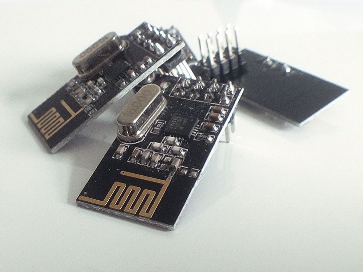

# NRF24
## Arduino library for Nordic Semiconductor NRF24L01+

The NRF24L01+ is a tiny 2.4GHz wireless transciever that's easy to integrate into projects, is very flexible and easily available from resellers as breakout boards.

There are several libraries for this chip online but this library has a couple things to differentiate it from the others. The biggest thing is that it doesn't require fixed payloads as almost all the other ones do. Everything is handled under the hood so you just send the data (up to 32 bytes) as you want.

[Datasheet](http://www.nordicsemi.com/eng/content/download/2726/34069/file/nRF24L01P_Product_Specification_1_0.pdf)

Several breakout boards are available, here are some i found:


Key focuses for the library:

* Very easy to use
* Abstract hardware complexity to clear APIs
* Possibility to choose network topology
* Fast and low power

Priorities:

1. Ease of use
2. High performance
3. Low power consumption
4. Abstracting all lower level functions

Bugs/tweaks/good to know:

* No known bugs
* Transmit speed could be made faster, currently not suitable for transmitting large amounts of data
* When using breakout boards with long wires the signal integrity for fast data may affect it too much and things can behave weird. The chip itself can run on 10MHz SPI clock but this is not realistic with long wires. Setting a slower SPI clock may help (by default /4 clock divider)


---

### Hardware setup

The chip is 5v tolerant on the IO but requires 3.3v power. Because of this it makes it easy to connect it to an Arduino.

Arduino pin | NRF24L01+ pin
----------- | -------------
13          | SCK
12          | MISO
11          | MOSI
10*         | CSN
9*          | CE
3.3v        | VCC
GND         | GND
2/3**       | IRQ

\* These pins can be changed. Make sure the code reflects this change. Note that the library uses the Arduino SPI library which requires 10 to be an output even if it's not used (or SPI ends up in slave mode).

\** The IRQ pin is not used in the library so it can be left unconnected.

---

### Software setup

Setup and configuration is kept to a minimum. All that's needed is to include the library, call ```begin()``` and use the library methods as desired.

The library allows a one-to-one topology, one-to-many topology or a combination of these.

In order for a node to reach another one a couple settings have to match:

* Same network channel
* Same CRC length
* Same netmask
* Unique addresses

#### One-to-many (broadcast)

This allows an event listener type interaction. One client sets its address and others listen to this address. 

Example:

```C++
#include <SPI.h>
#include <NRF24.h>

NRF24 radio;

bool tx;

void setup()
{
	Serial.begin(115200);
	Serial.println(F("NRF24 Broadcast example"));

	radio.begin(9, 10);

	// Pin 7 sets the mode (Sender or Receiver). Connect to GND on the sender
	pinMode(7, INPUT_PULLUP);
	tx = !digitalRead(7);

	if (tx)
	{
		radio.setAddress(0xD2);
	}
	else
	{
		radio.listenToAddress(0xD2);
	}

	Serial.print(F("TX mode: "));
	Serial.println(tx);
}

void loop()
{
	if (tx)
	{
		Serial.println(F("Broadcasting.. "));
		radio.broadcast("Hello world");
		delay(1000);
	}
	else if (radio.available())
	{
		char buf[32];
		uint8_t numBytes = radio.read(buf, sizeof(buf));
		Serial.print(F("Received "));
		Serial.print(numBytes);
		Serial.print(F(" bytes: "));
		Serial.println(buf);
	}
}
```
Make sure the address matches or the events are not received

#### One-to-one

In addition to a broadcast you can also target nodes directly using their addresses. 

```C++
#include <SPI.h>
#include <NRF24.h>

NRF24 radio;

bool tx;

void setup()
{
	Serial.begin(115200);
	Serial.println(F("NRF24 Send example"));

	radio.begin(9, 10);

	// Pin 7 sets the mode (Sender or Receiver). Connect to GND on the sender
	pinMode(7, INPUT_PULLUP);
	tx = !digitalRead(7);

	if (tx)
	{
		// transmitter doesn't need an address
	}
	else
	{
		// set our address
		// note the address of the received, we'll need it later on!
		radio.setAddress(0xD2);
		radio.startListening();
	}

	Serial.print(F("TX mode: "));
	Serial.println(tx);
}

void loop()
{
	if (tx)
	{
		Serial.print(F("Sending.. "));
		bool sent = radio.send(0xD2, "Hello there receiver 0xD2!");	// make sure the first parameter matches the receiver's address
		Serial.println(sent ? "OK" : "failed");
		delay(1000);
	}
	else if (radio.available())
	{
		char buf[32];
		uint8_t numBytes = radio.read(buf, sizeof(buf));
		Serial.print(F("Received: "));
		Serial.println(buf);
	}
}
```

See the examples for further use and have a look at [NRF24.h](NRF24.h) to see API functions
